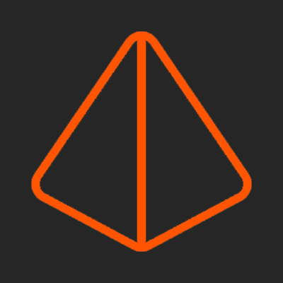

<!-- Improved compatibility of back to top link: See: https://github.com/othneildrew/Best-README-Template/pull/73 -->

<!--
*** Thanks for checking out the Best-README-Template. If you have a suggestion
*** that would make this better, please fork the repo and create a pull request
*** or simply open an issue with the tag "enhancement".
*** Don't forget to give the project a star!
*** Thanks again! Now go create something AMAZING! :D
-->

<!-- PROJECT SHIELDS -->
<!--
*** I'm using markdown "reference style" links for readability.
*** Reference links are enclosed in brackets [ ] instead of parentheses ( ).
*** See the bottom of this document for the declaration of the reference variables
*** for contributors-url, forks-url, etc. This is an optional, concise syntax you may use.
*** https://www.markdownguide.org/basic-syntax/#reference-style-links
-->

[![Contributors][contributors-shield]][contributors-url]
[![Forks][forks-shield]][forks-url]
[![Stargazers][stars-shield]][stars-url]
[![LinkedIn][linkedin-shield]][linkedin-url]

<!-- PROJECT LOGO -->
 

  

<h3 align="center">Next Project: GameStash</h3>

  

    Final frontend project of the molengeek formation
     
    <a href="https://github.com/timurlog/next-project"><strong>Explore the docs »</strong></a>
     
     
    <a href="https://github.com/timurlog/next-project">View Demo</a>
  

<!-- TABLE OF CONTENTS -->

  
Table of Contents

  <ol>
    <li>
      <a href="#about-the-project">About The Project</a>
      <ul>
        <li><a href="#built-with">Built With</a></li>
      </ul>
    </li>
    <li><a href="#usage">Usage</a></li>
    <li><a href="#roadmap">Roadmap</a></li>
    <li><a href="#deliverables">Deliverables</a></li>
    <li><a href="#contact">Contact</a></li>
  </ol>

<!-- ABOUT THE PROJECT -->

## About The Project

[![Product Name Screen Shot][product-screenshot]](https://example.com)

Not yet up to date

(<a href="#readme-top">back to top</a>)

### Built With

- [![Next][Next.js]][Next-url]
- HTML5
- CSS3
- JavaScript (ES6+)
- API: https://example-data.draftbit.com/books

(<a href="#readme-top">back to top</a>)

<!-- USAGE EXAMPLES -->

## Usage

Not yet up to date

(<a href="#readme-top">back to top</a>)

<!-- ROADMAP -->

## Roadmap

- [x] **Navbar**
- [ ] **Home page**
  - [x] Carousel header with 5 random products
  - [ ] Featured sections and affordable/highly rated products
- [ ] **Authentication**
  - [ ] **Login page:** Theme aligned with the general design of the site
  - [ ] **Registration Page:** Simple registration with real authentication
- [ ] **Product Management**
  - [ ] **Products Page:** List of products with advanced filters
  - [ ] **Product Details:** Detailed display by product ID without price but with option to add to cart/favorites
- [ ] **Cart and Favorites**
  - [ ] Full cart and favorites management functionality, accessible only to logged in users
  - [ ] Buttons to empty the cart and delete favorites
- [ ] **Interface and Interaction**
  - [ ] Asynchronous loading of API data with loading logo
  - [ ] Animations for loading components (optional)
  - [ ] Implementing a dark mode
- [ ] **Filtering and Advanced Search**
  - [ ] Various and varied filters depending on your products
  - [ ] Advanced search depending on your products (by title, author, genre, etc.)
- [ ] **Bonus Features**
  - [ ] Order Tracking: Simulate tracking for user orders
  - [ ] User Reviews: Display fictitious reviews to enrich the user experience
- [ ] **Responsive Design**
  - [ ] Ensuring a smooth and responsive user experience from Desktop L to mobile L

(<a href="#readme-top">back to top</a>)

<!-- DELIVERABLES -->

## Deliverables

- Complete source code of the project
- Functions of commented code
- Well-indented code, well decomposed and respecting all conventions
- Documentation detailing the site architecture, use of APIs, and deployment instructions (README)
- Link to deployed site

(<a href="#readme-top">back to top</a>)

<!-- CONTACT -->

## Contact

Timur Logie - [@timur_log](https://twitter.com/timur_log) - timur.logie@gmail.com

Project Link: [https://github.com/timurlog/next-project](https://github.com/timurlog/next-project)

(<a href="#readme-top">back to top</a>)

<!-- MARKDOWN LINKS & IMAGES -->
<!-- https://www.markdownguide.org/basic-syntax/#reference-style-links -->

[contributors-shield]: https://img.shields.io/github/contributors/timurlog/next-project.svg?style=for-the-badge
[contributors-url]: https://github.com/timurlog/next-project/graphs/contributors
[forks-shield]: https://img.shields.io/github/forks/timurlog/next-project.svg?style=for-the-badge
[forks-url]: https://github.com/timurlog/next-project/network/members
[stars-shield]: https://img.shields.io/github/stars/timurlog/next-project.svg?style=for-the-badge
[stars-url]: https://github.com/timurlog/next-project/stargazers
[issues-shield]: https://img.shields.io/github/issues/timurlog/next-project.svg?style=for-the-badge
[issues-url]: https://github.com/timurlog/next-project/issues
[license-shield]: https://img.shields.io/github/license/timurlog/next-project.svg?style=for-the-badge
[license-url]: https://github.com/timurlog/next-project/blob/master/LICENSE.txt
[linkedin-shield]: https://img.shields.io/badge/-LinkedIn-black.svg?style=for-the-badge&logo=linkedin&colorB=555
[linkedin-url]: https://linkedin.com/in/timur-logie/
[product-screenshot]: images/screenshot.png
[Next.js]: https://img.shields.io/badge/next.js-000000?style=for-the-badge&logo=nextdotjs&logoColor=white
[Next-url]: https://nextjs.org/
[React.js]: https://img.shields.io/badge/React-20232A?style=for-the-badge&logo=react&logoColor=61DAFB
[React-url]: https://reactjs.org/
[Vue.js]: https://img.shields.io/badge/Vue.js-35495E?style=for-the-badge&logo=vuedotjs&logoColor=4FC08D
[Vue-url]: https://vuejs.org/
[Angular.io]: https://img.shields.io/badge/Angular-DD0031?style=for-the-badge&logo=angular&logoColor=white
[Angular-url]: https://angular.io/
[Svelte.dev]: https://img.shields.io/badge/Svelte-4A4A55?style=for-the-badge&logo=svelte&logoColor=FF3E00
[Svelte-url]: https://svelte.dev/
[Laravel.com]: https://img.shields.io/badge/Laravel-FF2D20?style=for-the-badge&logo=laravel&logoColor=white
[Laravel-url]: https://laravel.com
[Bootstrap.com]: https://img.shields.io/badge/Bootstrap-563D7C?style=for-the-badge&logo=bootstrap&logoColor=white
[Bootstrap-url]: https://getbootstrap.com
[JQuery.com]: https://img.shields.io/badge/jQuery-0769AD?style=for-the-badge&logo=jquery&logoColor=white
[JQuery-url]: https://jquery.com
